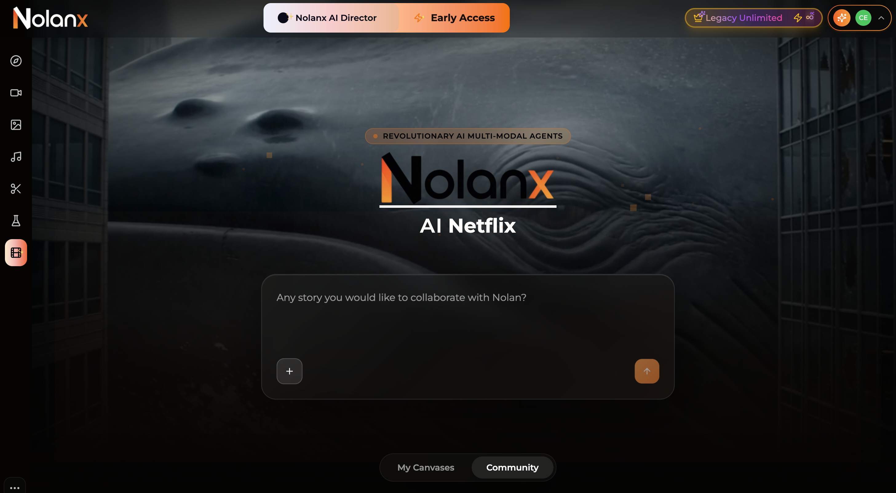
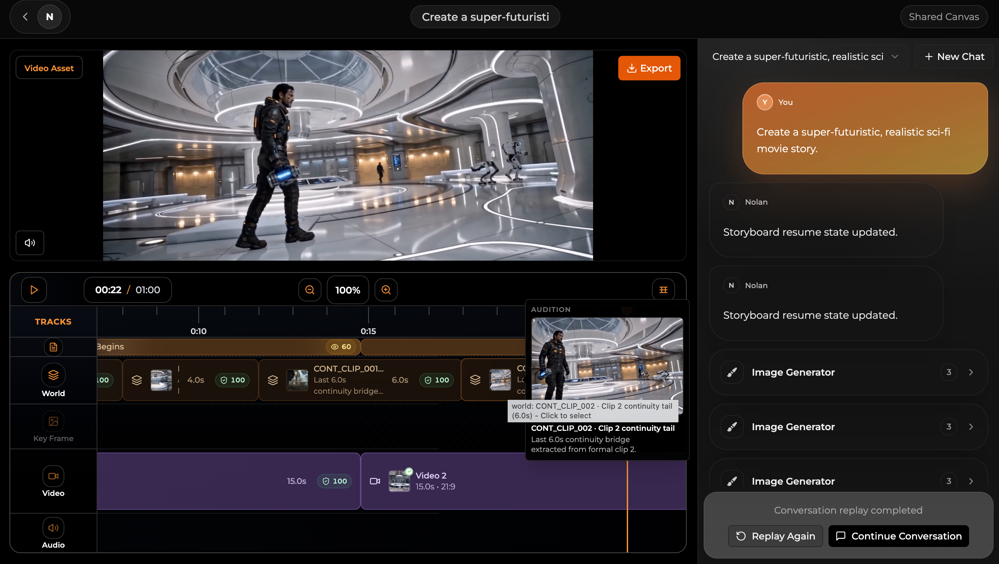
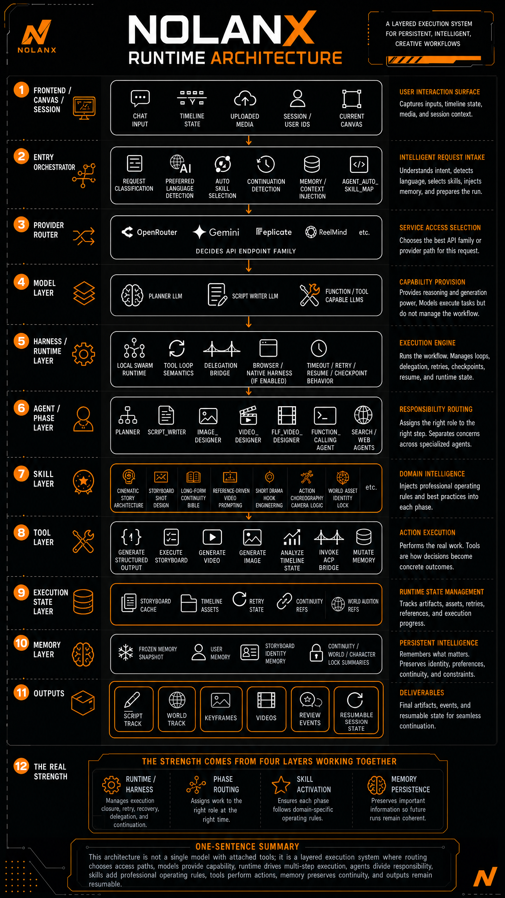

# NolanX

Open-source long-runtime multi-modal agent infrastructure for filmmaking.





NolanX is the system behind `nolanx.ai`. It is designed to push video models far beyond their native single-generation limits and keep long creative runs coherent across language, image, audio, and video.

With the right model stack, NolanX can turn short-form generators such as Seedance 2.0, Kling 03, Google Veo 3.1 Lite, LTX 2.3, PixVerse v6, Wan 2.7, and others into much longer production pipelines: 5 minutes, 30 minutes, even 1 hour.

It also keeps consistency across large agent workloads: story logic, screenplay, script breakdown, character views, scenes, props, sound, auditions, world assets, timeline editing, storyboard structure, dialogue, performance detail, and directorial reasoning.

## Why this exists

There are only two of us maintaining `reelmind.ai` and `nolanx.ai`.

I’m a 10-year entrepreneur, now living as an AI nomad between Serbia, Europe, and North Africa.

One day I told my partner Keii:

> If you can build something where one click, just one click, generates a movie like Nezha 3 or Interstellar 2, I’ll call you Dad.

Eventually, I built that technology myself.

I believe almost every serious AI film builder will end up extending models this way. And I believe many AI companies will too.

That is why I chose to open-source NolanX.

Sorry, Netflix. When I finally found the right disruptive slogan, I thought of you.

Have fun.

## Architecture



This repo is trimmed to the NolanX path. Community, membership, admin, and credit logic are out of scope here.

## Use NolanX

1. Use `nolanx.ai` directly with membership or credit packs
   Just open [nolanx.ai](https://nolanx.ai/).

2. Use the hosted API route if you want NolanX runtime behavior without wiring every provider yourself
   - `Text`: [OpenRouter](https://openrouter.ai/workspaces/default/keys)
   - `Image`: [FAL](https://fal.ai/dashboard/keys)
   - `Video`: [ReelMind](https://reelmind.ai/platform), our own API platform with a 5% markup
   - `Optional R2`: [Cloudflare R2](https://dash.cloudflare.com/?to=/:account/r2/overview)

3. Fully self-host it locally or privately
   Run the full stack yourself: web, API, and agent runtime.
   - Configure `apps/agent/config.toml` first
   - Use root `.env` only for local host/port overrides
   - Use `/nolanx` `Runtime Keys` when you want to edit runtime overlays
   - Replace providers, priorities, and storage paths as needed

## Quick start

Clone and start:

```bash
git clone https://github.com/nolanx-ai/nolanx.ai.git && cd nolanx.ai && ./dev.sh
```

Or, if you already cloned the repo:

```bash
cd nolanx.ai
./dev.sh
```

This starts:

- web: `http://localhost:3000`
- api: `http://localhost:8080`
- agent: `http://127.0.0.1:52178`

The browser opens `http://localhost:3000/nolanx` automatically after startup.

## Development

```bash
pnpm --dir apps/web build
pnpm --dir apps/api build
cd apps/agent && .venv/bin/python -m py_compile main.py
```

## Open-source runtime model

The stack is layered by capability.

### Text

- key: `OPENROUTER_API_KEY`
- default model: `google/gemini-3.1-pro-preview`
- responsibility: chat, planning, screenplay generation, routing, general reasoning
- link: [OpenRouter](https://openrouter.ai/workspaces/default/keys)
- self-host note: this is the first provider family you swap or extend

### Image

- key: `IMAGE_API_KEY`
- default model: `openai/gpt-image-2`
- responsibility: image generation, image editing, keyframes, visual references
- link: [FAL](https://fal.ai/dashboard/keys)
- self-host note: replace the image endpoint/provider with your preferred image stack

### Video

- key: `VIDEO_API_KEY`
- default model: `dreamina-seedance-2-0-260128`
- default endpoint: `https://nestapi.reelmind.ai/external-api/video/generate`
- responsibility: shot generation
- link: [ReelMind](https://reelmind.ai/platform)
- routing note: this is our own API platform and this routed path includes a 5% markup
- self-host note: replace this layer with your preferred video provider or internal endpoint

### Optional R2

- keys: `R2_ACCOUNT_ID`, `R2_ACCESS_KEY_ID`, `R2_SECRET_ACCESS_KEY`, `R2_BUCKET_NAME`, `R2_PUBLIC_URL`
- responsibility: uploaded references, generated assets, continuity-friendly persistent storage
- link: [Cloudflare R2](https://dash.cloudflare.com/?to=/:account/r2/overview)
- note: NolanX still runs without it, but storage-backed flows become more limited

### What happens if a key is missing

- no `OPENROUTER_API_KEY`: chat, planning, and script generation do not run
- no `IMAGE_API_KEY`: image generation and image editing do not run
- no `VIDEO_API_KEY`: video generation does not run
- no `R2_*`: NolanX still runs, but enhanced persistence / upload / continuity flows stay disabled

## Configure runtime keys

- Open `/nolanx` and click `Runtime Keys` for local overlays
- `apps/agent/config.toml` is the primary self-host configuration file
- `apps/api/data/runtime-config.json` stores UI-edited runtime values

## Local data

Local data lives under `apps/api/data`:

- `nolanx-db.json`
- `runtime-config.json`


## Credits

NolanX was inspired, in a small way, by the Jaaz project about a year ago.

Over that year we kept breaking through hard technical problems, modifying LangChain where needed, and learning from strong ideas in OpenClaw, Harness, Hermes, long-memory systems, and long-runtime agent design.

Thanks to the open-source community for the work that made this path possible.

This is our contribution back.
